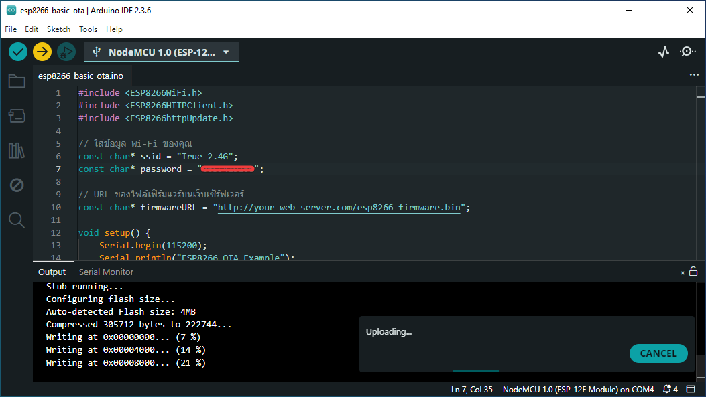
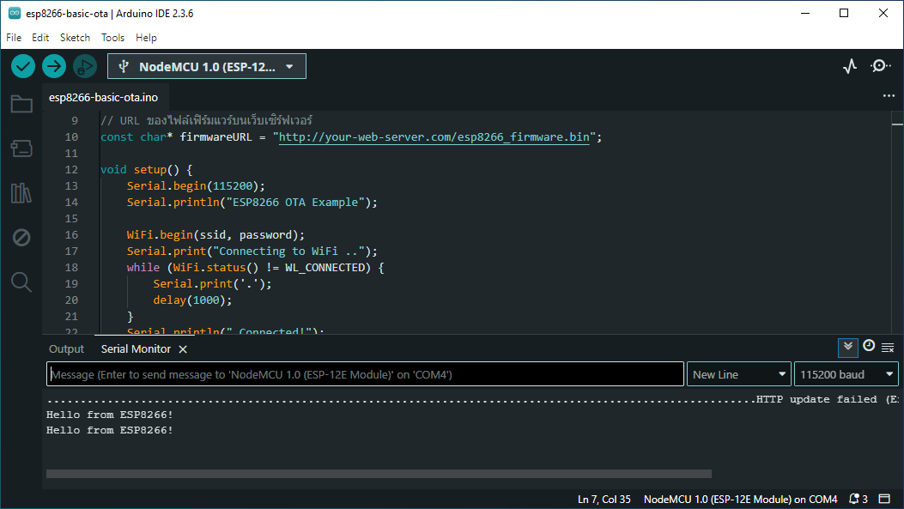

# OTA (Over-the-Air) 

สำหรับ ESP32 คือกระบวนการอัปเดตเฟิร์มแวร์ (firmware) หรือโปรแกรมที่ทำงานบน ESP32 ผ่านเครือข่าย Wi-Fi โดยไม่ต้องเชื่อมต่อ ESP32 กับคอมพิวเตอร์โดยตรงผ่านสาย USB

**ทำไม OTA ถึงมีความสำคัญ?**

* **ความสะดวก :** เมื่ออุปกรณ์ ESP32 ถูกติดตั้งในตำแหน่งที่เข้าถึงยาก การอัปเดตผ่าน OTA จะช่วยให้คุณไม่ต้องถอดอุปกรณ์ออกมาเพื่อเชื่อมต่อกับคอมพิวเตอร์
* **การจัดการระยะไกล :** สำหรับระบบ IoT (Internet of Things) ที่มีอุปกรณ์จำนวนมาก การอัปเดตเฟิร์มแวร์จากส่วนกลางผ่าน OTA จะช่วยประหยัดเวลาและทรัพยากรอย่างมาก
* **การปรับปรุงและแก้ไขข้อผิดพลาด :** เมื่อพบข้อผิดพลาดหรือต้องการเพิ่มฟังก์ชันใหม่ การอัปเดต OTA ช่วยให้สามารถแก้ไขและปรับปรุงได้อย่างรวดเร็วโดยไม่ต้องเสียเวลาในการเข้าถึงอุปกรณ์แต่ละตัว
* **การอัปเดตอย่างต่อเนื่อง :** ช่วยให้อุปกรณ์สามารถรับการอัปเดตฟีเจอร์ใหม่ ๆ หรือแพตช์ความปลอดภัยได้อย่างสม่ำเสมอ

**หลักการทำงานพื้นฐานของ OTA บน ESP32 :**

โดยทั่วไป กระบวนการ OTA บน ESP32 จะมีขั้นตอนหลัก ๆ ดังนี้ :

1.  **การเตรียมเฟิร์มแวร์ใหม่ :** คุณจะต้องคอมไพล์ (compile) เฟิร์มแวร์เวอร์ชันใหม่ที่คุณต้องการอัปโหลด
2.  **การจัดเก็บเฟิร์มแวร์ :** เฟิร์มแวร์ใหม่นี้จะถูกจัดเก็บไว้บนเซิร์ฟเวอร์ (เช่น เว็บเซิร์ฟเวอร์, เซิร์ฟเวอร์ FTP) หรือบนอุปกรณ์อื่นที่ ESP32 สามารถเข้าถึงได้ผ่านเครือข่าย
3.  **การเริ่มต้นกระบวนการ OTA :** โปรแกรมที่ทำงานอยู่บน ESP32 จะต้องมีส่วนของโค้ดที่ทำหน้าที่ตรวจสอบและเริ่มต้นกระบวนการ OTA โดยอาจจะมีการตรวจสอบเป็นระยะ หรือเมื่อได้รับคำสั่งจากภายนอก
4.  **การดาวน์โหลดเฟิร์มแวร์ :** ESP32 จะเชื่อมต่อกับเซิร์ฟเวอร์ที่จัดเก็บเฟิร์มแวร์ใหม่ และดาวน์โหลดไฟล์เฟิร์มแวร์มาเก็บไว้ในหน่วยความจำชั่วคราว
5.  **การตรวจสอบความถูกต้อง :** หลังจากดาวน์โหลดเฟิร์มแวร์เสร็จสิ้น ESP32 จะทำการตรวจสอบความถูกต้องของไฟล์ (เช่น การตรวจสอบ checksum) เพื่อให้แน่ใจว่าไฟล์ไม่เสียหายระหว่างการดาวน์โหลด
6.  **การเขียนเฟิร์มแวร์ใหม่ :** หากการตรวจสอบความถูกต้องผ่าน ESP32 จะเริ่มเขียนเฟิร์มแวร์ใหม่ลงในพื้นที่หน่วยความจำที่กำหนดไว้สำหรับการอัปเดต โดยปกติ ESP32 จะมีสองพาร์ทิชันสำหรับเก็บเฟิร์มแวร์ เพื่อให้สามารถสลับไปใช้เฟิร์มแวร์เก่าได้หากเกิดปัญหา
7.  **การรีบูต :** หลังจากเขียนเฟิร์มแวร์ใหม่เสร็จสิ้น ESP32 จะทำการรีบูตตัวเอง และจะบูตขึ้นมาจากเฟิร์มแวร์เวอร์ชันใหม่

**วิธีการใช้งาน OTA บน ESP32 (โดยทั่วไป) :**

ในการใช้งาน OTA บน ESP32 คุณจะต้อง :

* **ตั้งค่า Wi-Fi :** ESP32 จะต้องสามารถเชื่อมต่อกับเครือข่าย Wi-Fi ได้
* **เลือกวิธีการ OTA :** มีหลายวิธีในการทำ OTA บน ESP32 เช่น :
    * **HTTP OTA :** ESP32 ดาวน์โหลดเฟิร์มแวร์จากเว็บเซิร์ฟเวอร์
    * **HTTPS OTA :** เหมือนกับ HTTP OTA แต่มีการเข้ารหัสเพื่อความปลอดภัย
    * **mDNS OTA :** ใช้อุปกรณ์อื่นบนเครือข่ายเดียวกันเพื่ออัปโหลดเฟิร์มแวร์
    * **Firebase OTA :** ใช้บริการ Firebase ของ Google สำหรับการจัดเก็บและอัปโหลดเฟิร์มแวร์
* **เขียนโค้ดสำหรับ OTA :** คุณจะต้องเขียนโค้ดใน Arduino IDE หรือ ESP-IDF เพื่อจัดการกระบวนการ OTA ตั้งแต่การตรวจสอบการอัปเดต การดาวน์โหลด การตรวจสอบความถูกต้อง และการเขียนเฟิร์มแวร์ใหม่
* **สร้างสคริปต์อัปโหลด (ถ้าจำเป็น) :** สำหรับบางวิธี เช่น HTTP OTA คุณอาจจะต้องสร้างสคริปต์บนเซิร์ฟเวอร์เพื่อรับและจัดการไฟล์เฟิร์มแวร์

**ข้อควรระวังในการทำ OTA :**

* **ความเสถียรของเครือข่าย :** การเชื่อมต่อเครือข่ายที่ไม่เสถียรอาจทำให้การอัปเดตล้มเหลวและอาจทำให้อุปกรณ์ใช้งานไม่ได้
* **การจัดการพลังงาน :** ตรวจสอบให้แน่ใจว่าอุปกรณ์มีพลังงานเพียงพอในระหว่างการอัปเดต หากพลังงานถูกตัดขาดระหว่างการอัปเดต อาจทำให้เฟิร์มแวร์เสียหาย
* **การตรวจสอบความถูกต้อง :** การตรวจสอบ checksum หรือลายเซ็นดิจิทัลของเฟิร์มแวร์ใหม่เป็นสิ่งสำคัญ เพื่อป้องกันการติดตั้งเฟิร์มแวร์ที่ไม่ถูกต้องหรือถูกแก้ไข
* **กลไกการ Rollback :** การมีกลไกที่ช่วยให้สามารถกลับไปใช้เฟิร์มแวร์เวอร์ชันก่อนหน้าได้ในกรณีที่เกิดปัญหาหลังจากการอัปเดตเป็นสิ่งสำคัญ

## ตัวอย่างการใช้งานบนบอร์ด ESP32

เพื่อให้เห็นภาพชัดเจนขึ้น ผมจะยกตัวอย่างการใช้งาน OTA บน ESP32 โดยใช้ไลบรารี `ESPhttpUpdate` ใน Arduino IDE ซึ่งเป็นวิธีที่ค่อนข้างง่ายและนิยมใช้กันครับ

**สิ่งที่ต้องมี :**

1.  **ESP32 Board :** บอร์ด ESP32 ที่เชื่อมต่อกับ Wi-Fi ได้
2.  **Arduino IDE :** ติดตั้งบนคอมพิวเตอร์ของคุณ และตั้งค่าให้รองรับ ESP32 แล้ว
3.  **เว็บเซิร์ฟเวอร์ :** พื้นที่สำหรับจัดเก็บไฟล์เฟิร์มแวร์ `.bin` ที่ ESP32 สามารถเข้าถึงได้ผ่าน HTTP (คุณสามารถใช้บริการเว็บโฮสติงฟรี หรือ Raspberry Pi ที่ทำหน้าที่เป็นเว็บเซิร์ฟเวอร์ก็ได้)
4.  **ไฟล์เฟิร์มแวร์ `.bin` :** ไฟล์ที่คุณคอมไพล์จากโปรแกรม Arduino สำหรับ ESP32

**ขั้นตอนการทำงาน :**

```c++
#include <WiFi.h>
#include <HTTPClient.h>
#include <ESPhttpUpdate.h>

// ใส่ข้อมูล Wi-Fi ของคุณ
const char* ssid = "YOUR_WIFI_SSID";
const char* password = "YOUR_WIFI_PASSWORD";

// URL ของไฟล์เฟิร์มแวร์บนเว็บเซิร์ฟเวอร์
const char* firmwareURL = "http://your-web-server.com/firmware.bin";

void setup() {
    Serial.begin(115200);
    Serial.println("ESP32 OTA Example");

    WiFi.begin(ssid, password);
    Serial.print("Connecting to WiFi ..");
    while (WiFi.status() != WL_CONNECTED) {
    Serial.print('.');
    delay(1000);
    }
    Serial.println(" Connected!");

    // ตรวจสอบและอัปเดตเฟิร์มแวร์
    updateFirmware();
}

void loop() {
    // โปรแกรมหลักของคุณจะทำงานที่นี่
    Serial.println("Hello from ESP32!");
    delay(5000);
}

void updateFirmware() {
    Serial.println("Checking for new firmware ...");

    t_httpUpdate_return ret = ESPhttpUpdate.update(firmwareURL);

    switch (ret) {
    case HTTP_UPDATE_OK:
        Serial.println("Firmware update successful! Rebooting ...");
        ESP.restart();
        break;
    case HTTP_UPDATE_FAILED:
        Serial.printf("HTTP update failed (Error %d): %s\n", ESPhttpUpdate.getLastError(), ESPhttpUpdate.getLastErrorString().c_str());
        break;
    case HTTP_UPDATE_NO_UPDATES:
        Serial.println("No new firmware available.");
        break;
    }
}
```

1.  **คัดลอกตัวอย่าง Code Arduino สำหรับ ESP32 ด้านบน :**

2.  **แก้ไขโค้ด :**

    * แทนที่ `"YOUR_WIFI_SSID"` และ `"YOUR_WIFI_PASSWORD"` ด้วยชื่อและรหัสผ่าน Wi-Fi ของคุณ
    * แทนที่ `"http://your-web-server.com/firmware.bin"` ด้วย URL ที่ชี้ไปยังไฟล์เฟิร์มแวร์ `.bin` บนเว็บเซิร์ฟเวอร์ของคุณ

3.  **อัปโหลดโค้ดเริ่มต้น :** อัปโหลดโค้ดนี้ไปยัง ESP32 ของคุณผ่านสาย USB เป็นครั้งแรก (เพื่อให้ ESP32 สามารถเชื่อมต่อ Wi-Fi และมีฟังก์ชัน OTA)

4.  **คอมไพล์เฟิร์มแวร์เวอร์ชันใหม่ :** เมื่อคุณต้องการอัปเดตโปรแกรม ให้แก้ไขโค้ด Arduino ของคุณตามต้องการ แล้วคอมไพล์ (Sketch > Export Compiled Binary) จะได้ไฟล์ `.bin`

5.  **อัปโหลดเฟิร์มแวร์ใหม่ไปยังเว็บเซิร์ฟเวอร์ :** นำไฟล์ `.bin` ที่คอมไพล์ได้ ไปวางไว้บนเว็บเซิร์ฟเวอร์ของคุณ ในตำแหน่งที่ URL `firmwareURL` ในโค้ดชี้ถึง

6.  **ESP32 ตรวจสอบและอัปเดต :** เมื่อ ESP32 ทำงาน มันจะเชื่อมต่อ Wi-Fi และเรียกใช้ฟังก์ชัน `updateFirmware()` ซึ่งจะพยายามดาวน์โหลดไฟล์จาก `firmwareURL` หากดาวน์โหลดสำเร็จและเป็นไฟล์ที่ถูกต้อง ESP32 จะทำการติดตั้งเฟิร์มแวร์ใหม่และรีบูตตัวเอง

**ตัวอย่างการทำงาน :**

สมมติว่าคุณมีโปรแกรม Arduino ที่แสดงข้อความ "Hello from ESP32! Version 1" ทุก 5 วินาที

1.  คุณอัปโหลดโค้ดข้างต้น (โดยใส่ URL ของเฟิร์มแวร์เวอร์ชัน 1) ไปยัง ESP32 ผ่าน USB

2.  จากนั้น คุณแก้ไขโค้ด Arduino ให้แสดงข้อความ "Hello from ESP32! Version 2" แล้วคอมไพล์เป็น `firmware.bin` และอัปโหลดไปยังเว็บเซิร์ฟเวอร์ของคุณ

3.  เมื่อ ESP32 ทำงาน มันจะเชื่อมต่อ Wi-Fi และตรวจสอบ URL ที่กำหนดไว้ หากพบไฟล์เฟิร์มแวร์ใหม่ มันจะดาวน์โหลด ติดตั้ง และรีบูต

4.  หลังจากรีบูต ESP32 จะเริ่มทำงานด้วยเฟิร์มแวร์เวอร์ชันใหม่ และข้อความที่แสดงใน Serial Monitor จะเปลี่ยนเป็น "Hello from ESP32! Version 2"

**ข้อสังเกต :**

* นี่เป็นเพียงตัวอย่างพื้นฐานของการทำ HTTP OTA คุณสามารถปรับปรุงให้มีการตรวจสอบเวอร์ชันของเฟิร์มแวร์ก่อนดาวน์โหลด เพื่อหลีกเลี่ยงการดาวน์โหลดซ้ำหากไม่มีการอัปเดต
* สำหรับการใช้งานจริง ควรพิจารณาเรื่องความปลอดภัย เช่น การใช้ HTTPS เพื่อเข้ารหัสการสื่อสาร หรือการตรวจสอบลายเซ็นดิจิทัลของเฟิร์มแวร์
* ไลบรารี `ESPhttpUpdate` มีฟังก์ชันเพิ่มเติม เช่น การแสดง progress bar ในระหว่างการดาวน์โหลด ซึ่งคุณสามารถนำมาใช้งานได้

หวังว่าตัวอย่างนี้จะช่วยให้คุณเห็นภาพการใช้งาน OTA บน ESP32 ได้ชัดเจนขึ้นนะครับ ลองนำไปประยุกต์ใช้กับโปรเจกต์ของคุณดูได้เลย หากมีคำถามเพิ่มเติม ถามได้เลยนะครับ!

## ตัวอย่างการใช้งานบนบอร์ด ESP8266

ตัวอย่างโค้ดสำหรับการใช้งาน OTA บน ESP8266 โดยใช้ไลบรารี `ESP8266httpUpdate` By [Matej Sychra](https://github.com/suculent/esp32-http-update) (v2.1.145)

**ตัวอย่างโค้ด OTA สำหรับ ESP8266 (Arduino IDE) :**

**สิ่งที่ต้องมี:**

1.  **ESP8266 Board :** บอร์ด ESP8266 ที่เชื่อมต่อกับ Wi-Fi ได้
2.  **Arduino IDE :** ติดตั้งบนคอมพิวเตอร์ของคุณ และตั้งค่าให้รองรับ ESP8266 แล้ว
3.  **เว็บเซิร์ฟเวอร์ :** พื้นที่สำหรับจัดเก็บไฟล์เฟิร์มแวร์ `.bin` ที่ ESP8266 สามารถเข้าถึงได้ผ่าน HTTP(S)
4.  **ไฟล์เฟิร์มแวร์ `.bin` :** ไฟล์ที่คุณคอมไพล์จากโปรแกรม Arduino สำหรับ ESP8266

```c++
#include <ESP8266WiFi.h>
#include <ESP8266HTTPClient.h>
#include <ESP8266httpUpdate.h>

// ใส่ข้อมูล Wi-Fi ของคุณ
const char* ssid = "YOUR_WIFI_SSID";
const char* password = "YOUR_WIFI_PASSWORD";

// URL ของไฟล์เฟิร์มแวร์บนเว็บเซิร์ฟเวอร์
const char* firmwareURL = "http://your-web-server.com/esp8266_firmware.bin";

void setup() {
    Serial.begin(115200);
    Serial.println("ESP8266 OTA Example");

    WiFi.begin(ssid, password);
    Serial.print("Connecting to WiFi ..");
    while (WiFi.status() != WL_CONNECTED) {
        Serial.print('.');
        delay(1000);
    }
    Serial.println(" Connected!");

    // ตรวจสอบและอัปเดตเฟิร์มแวร์
    updateFirmware();
}

void loop() {
    // โปรแกรมหลักของคุณจะทำงานที่นี่
    Serial.println("Hello from ESP8266!");
    delay(5000);
}

void updateFirmware() {
    Serial.println("Checking for new firmware ...");

    t_httpUpdate_return ret = HTTP_UPDATE_FAILED; // ประกาศและกำหนดค่าเริ่มต้นให้ ret

    WiFiClient client;
    if (WiFi.status() == WL_CONNECTED) {
        ret = ESPhttpUpdate.update(client, firmwareURL);
    } else {
        Serial.println("WiFi not connected. Cannot perform OTA.");
        return;
    }

    switch (ret) {
        case HTTP_UPDATE_OK:
        Serial.println("Firmware update successful! Rebooting ...");
        ESP.restart();
        break;
        case HTTP_UPDATE_FAILED:
        Serial.printf("HTTP update failed (Error %d): %s\n", ESPhttpUpdate.getLastError(), ESPhttpUpdate.getLastErrorString().c_str());
        break;
        case HTTP_UPDATE_NO_UPDATES:
        Serial.println("No new firmware available.");
        break;
    }
}

// ฟังก์ชัน callback สำหรับแสดง progress (optional)
void updateProgress(int current, int total) {
    Serial.printf("Progress: %d%%\r", (current * 100) / total);
}

// ฟังก์ชัน updateFirmware ที่มีการใช้งาน progress bar (optional)
void updateFirmwareWithProgress() {
    Serial.println("Checking for new firmware ...");

    ESPhttpUpdate.onProgress(updateProgress);

    t_httpUpdate_return ret = HTTP_UPDATE_FAILED; // ประกาศและกำหนดค่าเริ่มต้นให้ ret

    WiFiClient client;
    if (WiFi.status() == WL_CONNECTED) {
        ret = ESPhttpUpdate.update(client, firmwareURL);
    } else {
        Serial.println("WiFi not connected. Cannot perform OTA.");
        ESPhttpUpdate.onProgress(nullptr);
        return;
    }

    ESPhttpUpdate.onProgress(nullptr);

    switch (ret) {
        case HTTP_UPDATE_OK:
        Serial.println("\nFirmware update successful! Rebooting ...");
        ESP.restart();
        break;
        case HTTP_UPDATE_FAILED:
        Serial.printf("\nHTTP update failed (Error %d): %s\n", ESPhttpUpdate.getLastError(), ESPhttpUpdate.getLastErrorString().c_str());
        break;
        case HTTP_UPDATE_NO_UPDATES:
        Serial.println("\nNo new firmware available.");
        break;
    }
}
```





**คำอธิบาย Code**

ผมจะอธิบายโค้ดนี้ทีละส่วนเพื่อให้คุณเข้าใจการทำงานทั้งหมดครับ โค้ดนี้เป็นตัวอย่างการทำ Over-the-Air (OTA) บน ESP8266 โดยใช้ Arduino IDE

**1. `#include` Directives :**

```c++
#include <ESP8266WiFi.h>
#include <ESP8266HTTPClient.h>
#include <ESP8266httpUpdate.h>
```

* `#include <ESP8266WiFi.h>` : รวมไลบรารีสำหรับจัดการการเชื่อมต่อ Wi-Fi บน ESP8266 ซึ่งจำเป็นสำหรับการเชื่อมต่อกับเครือข่ายเพื่อดาวน์โหลดเฟิร์มแวร์ใหม่
* `#include <ESP8266HTTPClient.h>` : รวมไลบรารีสำหรับทำ HTTP requests ซึ่งอาจถูกใช้โดยไลบรารี `ESP8266httpUpdate` ในการดาวน์โหลดไฟล์เฟิร์มแวร์ (แม้ว่าในตัวอย่างนี้จะไม่ได้ใช้โดยตรง แต่ไลบรารี OTA อาจใช้ภายใน)
* `#include <ESP8266httpUpdate.h>` : รวมไลบรารีหลักสำหรับการทำ OTA บน ESP8266 ซึ่งมีฟังก์ชันในการตรวจสอบ ดาวน์โหลด และติดตั้งเฟิร์มแวร์ใหม่

**2. กำหนดค่า Wi-Fi และ URL ของเฟิร์มแวร์ :**

```c++
// ใส่ข้อมูล Wi-Fi ของคุณ
const char* ssid = "YOUR_WIFI_SSID";
const char* password = "YOUR_WIFI_PASSWORD";

// URL ของไฟล์เฟิร์มแวร์บนเว็บเซิร์ฟเวอร์
const char* firmwareURL = "http://your-web-server.com/esp8266_firmware.bin";
```

* `ssid` : ตัวแปรสำหรับเก็บชื่อเครือข่าย Wi-Fi ที่ ESP8266 จะเชื่อมต่อ คุณต้องแทนที่ `"YOUR_WIFI_SSID"` ด้วยชื่อเครือข่าย Wi-Fi ของคุณ
* `password` : ตัวแปรสำหรับเก็บรหัสผ่านของเครือข่าย Wi-Fi คุณต้องแทนที่ `"YOUR_WIFI_PASSWORD"` ด้วยรหัสผ่าน Wi-Fi ของคุณ
* `firmwareURL` : ตัวแปรสำหรับเก็บ URL ของไฟล์เฟิร์มแวร์ `.bin` ที่อยู่บนเว็บเซิร์ฟเวอร์ เมื่อ ESP8266 ต้องการอัปเดต มันจะดาวน์โหลดไฟล์จาก URL นี้ คุณต้องแทนที่ `"http://your-web-server.com/esp8266_firmware.bin"` ด้วย URL จริงของไฟล์เฟิร์มแวร์ของคุณ

**3. ฟังก์ชัน `setup()` :**

```c++
void setup() {
    Serial.begin(115200);
    Serial.println("ESP8266 OTA Example");

    WiFi.begin(ssid, password);
    Serial.print("Connecting to WiFi ..");
    while (WiFi.status() != WL_CONNECTED) {
        Serial.print('.');
        delay(1000);
    }
    Serial.println(" Connected!");

    // ตรวจสอบและอัปเดตเฟิร์มแวร์
    updateFirmware();
}
```

* `Serial.begin(115200)` : เริ่มการสื่อสารผ่าน Serial Monitor ที่ความเร็ว 115200 bps เพื่อแสดงผลข้อมูลต่างๆ
* `Serial.println("ESP8266 OTA Example")` : พิมพ์ข้อความเริ่มต้นไปยัง Serial Monitor
* `WiFi.begin(ssid, password)` : เริ่มการเชื่อมต่อ Wi-Fi โดยใช้ชื่อเครือข่าย (`ssid`) และรหัสผ่าน (`password`) ที่กำหนดไว้
* `while (WiFi.status() != WL_CONNECTED)` : วนลูปเพื่อรอจนกว่า ESP8266 จะเชื่อมต่อกับ Wi-Fi สำเร็จ ในระหว่างนี้จะพิมพ์จุด (`.`) ทุกๆ 1 วินาที
* `Serial.println(" Connected!")` : เมื่อเชื่อมต่อ Wi-Fi สำเร็จ จะพิมพ์ข้อความไปยัง Serial Monitor
* `updateFirmware()` : เรียกฟังก์ชัน `updateFirmware()` เพื่อเริ่มกระบวนการตรวจสอบและอัปเดตเฟิร์มแวร์

**4. ฟังก์ชัน `loop()` :**

```c++
void loop() {
    // โปรแกรมหลักของคุณจะทำงานที่นี่
    Serial.println("Hello from ESP8266!");
    delay(5000);
}
```

* ฟังก์ชัน `loop()` เป็นส่วนของโปรแกรมหลักที่จะทำงานซ้ำๆ หลังจากฟังก์ชัน `setup()` ทำงานเสร็จสิ้น
* `Serial.println("Hello from ESP8266!")`: พิมพ์ข้อความไปยัง Serial Monitor ทุกๆ 5 วินาที
* `delay(5000)` : หน่วงเวลา 5000 มิลลิวินาที (5 วินาที)

**5. ฟังก์ชัน `updateFirmware()` :**

```c++
void updateFirmware() {
    Serial.println("Checking for new firmware ...");

    t_httpUpdate_return ret = HTTP_UPDATE_FAILED; // ประกาศและกำหนดค่าเริ่มต้นให้ ret

    WiFiClient client;
    if (WiFi.status() == WL_CONNECTED) {
        ret = ESPhttpUpdate.update(client, firmwareURL);
    } else {
        Serial.println("WiFi not connected. Cannot perform OTA.");
        return;
    }

    switch (ret) {
        case HTTP_UPDATE_OK:
            Serial.println("Firmware update successful! Rebooting ...");
            ESP.restart();
            break;
        case HTTP_UPDATE_FAILED:
            Serial.printf("HTTP update failed (Error %d): %s\n", ESPhttpUpdate.getLastError(), ESPhttpUpdate.getLastErrorString().c_str());
            break;
        case HTTP_UPDATE_NO_UPDATES:
            Serial.println("No new firmware available.");
            break;
    }
}
```

* `Serial.println("Checking for new firmware ...")` : พิมพ์ข้อความเมื่อเริ่มตรวจสอบเฟิร์มแวร์ใหม่
* `t_httpUpdate_return ret = HTTP_UPDATE_FAILED;` : ประกาศตัวแปร `ret` ซึ่งเป็นตัวแปรประเภท `t_httpUpdate_return` เพื่อเก็บสถานะของการอัปเดต และกำหนดค่าเริ่มต้นเป็น `HTTP_UPDATE_FAILED`
* `WiFiClient client;` : สร้างอ็อบเจกต์ `WiFiClient` ซึ่งใช้สำหรับการเชื่อมต่อ HTTP
* `if (WiFi.status() == WL_CONNECTED)` : ตรวจสอบว่า ESP8266 เชื่อมต่อกับ Wi-Fi แล้วหรือไม่
    * ถ้าเชื่อมต่อแล้ว :
        * `ret = ESPhttpUpdate.update(client, firmwareURL);` : เรียกฟังก์ชัน `update()` จากไลบรารี `ESPhttpUpdate` เพื่อดาวน์โหลดและติดตั้งเฟิร์มแวร์ใหม่จาก `firmwareURL` โดยใช้ `WiFiClient` สำหรับการเชื่อมต่อ ผลลัพธ์ของการอัปเดตจะถูกเก็บไว้ในตัวแปร `ret`
    * ถ้ายังไม่ได้เชื่อมต่อ :
        * `Serial.println("WiFi not connected. Cannot perform OTA.")` : พิมพ์ข้อความแจ้งว่าไม่สามารถทำ OTA ได้เนื่องจากไม่ได้เชื่อมต่อ Wi-Fi
        * `return;` : ออกจากฟังก์ชัน `updateFirmware()`
* `switch (ret)` : ตรวจสอบค่าของ `ret` เพื่อดูผลลัพธ์ของการอัปเดต
    * `case HTTP_UPDATE_OK` : ถ้าการอัปเดตสำเร็จ จะพิมพ์ข้อความและรีบูต ESP8266 โดยใช้ `ESP.restart()` เพื่อให้เริ่มทำงานด้วยเฟิร์มแวร์ใหม่
    * `case HTTP_UPDATE_FAILED` : ถ้าการอัปเดตล้มเหลว จะพิมพ์ข้อความแสดงข้อผิดพลาดและรายละเอียดของข้อผิดพลาดโดยใช้ `ESPhttpUpdate.getLastError()` และ `ESPhttpUpdate.getLastErrorString()`
    * `case HTTP_UPDATE_NO_UPDATES` : ถ้าไม่มีเฟิร์มแวร์ใหม่ (เช่น เซิร์ฟเวอร์แจ้งว่าเฟิร์มแวร์ที่ดาวน์โหลดมาเป็นเวอร์ชันเดียวกับที่ใช้อยู่) จะพิมพ์ข้อความแจ้ง

**6. ฟังก์ชัน `updateProgress()` (Optional) :**

```c++
// ฟังก์ชัน callback สำหรับแสดง progress (optional)
void updateProgress(int current, int total) {
    Serial.printf("Progress: %d%%\r", (current * 100) / total);
}
```

* ฟังก์ชันนี้เป็นฟังก์ชัน callback ที่สามารถกำหนดให้กับไลบรารี `ESPhttpUpdate` เพื่อให้แสดงความคืบหน้าของการดาวน์โหลดเฟิร์มแวร์
* `current` : จำนวนไบต์ที่ดาวน์โหลดแล้ว
* `total` : จำนวนไบต์ทั้งหมดของไฟล์เฟิร์มแวร์
* `Serial.printf("Progress: %d%%\r", (current * 100) / total);` : คำนวณเปอร์เซ็นต์ความคืบหน้าและพิมพ์ไปยัง Serial Monitor โดยใช้ `\r` เพื่อให้เคอร์เซอร์กลับไปที่ต้นบรรทัด ทำให้ progress bar ดูเหมือนมีการอัปเดตอยู่กับที่

**7. ฟังก์ชัน `updateFirmwareWithProgress()` (Optional) :**

```c++
// ฟังก์ชัน updateFirmware ที่มีการใช้งาน progress bar (optional)
void updateFirmwareWithProgress() {
    Serial.println("Checking for new firmware ...");

    ESPhttpUpdate.onProgress(updateProgress);

    t_httpUpdate_return ret = HTTP_UPDATE_FAILED; // ประกาศและกำหนดค่าเริ่มต้นให้ ret

    WiFiClient client;
    if (WiFi.status() == WL_CONNECTED) {
        ret = ESPhttpUpdate.update(client, firmwareURL);
    } else {
        Serial.println("WiFi not connected. Cannot perform OTA.");
        ESPhttpUpdate.onProgress(nullptr);
        return;
    }

    ESPhttpUpdate.onProgress(nullptr);

    switch (ret) {
        case HTTP_UPDATE_OK:
            Serial.println("\nFirmware update successful! Rebooting ...");
            ESP.restart();
            break;
        case HTTP_UPDATE_FAILED:
            Serial.printf("\nHTTP update failed (Error %d): %s\n", ESPhttpUpdate.getLastError(), ESPhttpUpdate.getLastErrorString().c_str());
            break;
        case HTTP_UPDATE_NO_UPDATES:
            Serial.println("\nNo new firmware available.");
            break;
    }
}
```

* ฟังก์ชันนี้คล้ายกับ `updateFirmware()` แต่มีการเพิ่มการใช้งานฟังก์ชัน `updateProgress()` เพื่อแสดงความคืบหน้าของการดาวน์โหลด
* `ESPhttpUpdate.onProgress(updateProgress);` : กำหนดให้ฟังก์ชัน `updateProgress()` เป็น callback ที่จะถูกเรียกในระหว่างการดาวน์โหลด
* `ESPhttpUpdate.onProgress(nullptr);` : ยกเลิกการใช้งาน callback หลังจากกระบวนการอัปเดตเสร็จสิ้น

โดยรวมแล้ว โค้ดนี้จะทำการเชื่อมต่อ ESP8266 กับเครือข่าย Wi-Fi ที่กำหนด จากนั้นจะตรวจสอบว่ามีการอัปเดตเฟิร์มแวร์ใหม่หรือไม่จาก URL ที่ระบุ หากมีเฟิร์มแวร์ใหม่ จะทำการดาวน์โหลดและติดตั้ง หลังจากติดตั้งเสร็จสิ้น ESP8266 จะรีบูตตัวเองเพื่อเริ่มทำงานด้วยเฟิร์มแวร์เวอร์ชันใหม่ ส่วนฟังก์ชันที่มีคำว่า "(optional)" นั้นเป็นส่วนเพิ่มเติมสำหรับการแสดงความคืบหน้าของการอัปเดต ซึ่งคุณสามารถเลือกใช้งานหรือไม่ก็ได้ครับ

**วิธีการใช้งาน :**

1.  ติดตั้งบอร์ด ESP8266 ใน Arduino IDE (ถ้ายังไม่ได้ทำ)
2.  ติดตั้งไลบรารี **`ESP8266httpUpdate`** ผ่าน Library Manager (Sketch > Include Library > Manage Libraries... แล้วค้นหาและติดตั้ง)
3.  แก้ไขโค้ด :
    * แทนที่ `"YOUR_WIFI_SSID"` และ `"YOUR_WIFI_PASSWORD"` ด้วยข้อมูล Wi-Fi ของคุณ
    * แทนที่ `"http://your-web-server.com/esp8266_firmware.bin"` ด้วย URL ที่ชี้ไปยังไฟล์เฟิร์มแวร์ `.bin` สำหรับ ESP8266 บนเว็บเซิร์ฟเวอร์ของคุณ (ชื่อไฟล์ควรสื่อถึงว่าเป็นเฟิร์มแวร์สำหรับ ESP8266)
4.  อัปโหลดโค้ดเริ่มต้นไปยัง ESP8266 ผ่านสาย USB
5.  คอมไพล์เฟิร์มแวร์เวอร์ชันใหม่สำหรับ ESP8266 และอัปโหลดไฟล์ `.bin` ไปยังเว็บเซิร์ฟเวอร์
6.  เมื่อ ESP8266 ทำงาน มันจะตรวจสอบและพยายามอัปเดตเฟิร์มแวร์จาก URL ที่กำหนด

**ข้อมูลเปรียบเทียบความแตกต่างระหว่าง OTA บน ESP32 และ ESP8266 :**

| คุณสมบัติ           | ESP32                                  | ESP8266                                  |
| ------------------ | -------------------------------------- | -------------------------------------- |
| **ไลบรารี Wi-Fi** | `#include <WiFi.h>`                    | `#include <ESP8266WiFi.h>`               |
| **ไลบรารี HTTP Update** | `#include <ESPhttpUpdate.h>`            | `#include <ESP8266httpUpdate.h>`        |
| **ความเร็วในการอัปเดต** | โดยทั่วไปเร็วกว่า เนื่องจากมีประสิทธิภาพของ CPU และ Wi-Fi ที่สูงกว่า | อาจช้ากว่า ESP32 ขึ้นอยู่กับขนาดเฟิร์มแวร์และสัญญาณ Wi-Fi |
| **การรองรับ HTTPS** | รองรับได้ดีกว่าและง่ายกว่า             | รองรับ แต่บางครั้งอาจต้องใช้ไลบรารีเพิ่มเติมหรือมีการตั้งค่าที่ซับซ้อนกว่า |
| **พาร์ทิชันสำหรับ OTA** | มีระบบพาร์ทิชันที่ชัดเจนสำหรับการอัปเดต ทำให้การ rollback (ถ้ามีการ Implement) ทำได้ง่าย | มีข้อจำกัดด้านพาร์ทิชันมากกว่า อาจต้องจัดการพื้นที่หน่วยความจำด้วยตนเองมากกว่า |
| **ความซับซ้อนในการ Implement** | โดยทั่วไปง่ายกว่าเล็กน้อย เนื่องจากมีไลบรารีและตัวอย่างที่สมบูรณ์กว่า | อาจต้องมีการปรับแต่งโค้ดเพิ่มเติมในบางกรณี |
| **เสถียรภาพในการอัปเดต** | มักมีความเสถียรสูงกว่า               | อาจพบปัญหาการอัปเดตล้มเหลวได้บ้างในบางสถานการณ์ |
| **ขนาดเฟิร์มแวร์** | รองรับเฟิร์มแวร์ขนาดใหญ่ได้ดีกว่า     | มีข้อจำกัดด้านหน่วยความจำ ทำให้ขนาดเฟิร์มแวร์ที่อัปเดตได้มีขนาดจำกัด |

**สรุป:**

หลักการทำงานของการทำ OTA บน ESP32 และ ESP8266 นั้นคล้ายคลึงกัน คือการดาวน์โหลดเฟิร์มแวร์ใหม่จากเซิร์ฟเวอร์ผ่าน Wi-Fi และทำการติดตั้ง อย่างไรก็ตาม มีความแตกต่างกันในเรื่องของไลบรารีที่ใช้ ประสิทธิภาพ และความสามารถบางอย่าง

โดยทั่วไป ESP32 จะมีความยืดหยุ่นและมีประสิทธิภาพในการทำ OTA ที่ดีกว่า ESP8266 เนื่องจากมีทรัพยากรฮาร์ดแวร์ที่มากกว่าและการรองรับที่สมบูรณ์กว่า แต่ ESP8266 ก็ยังคงสามารถทำ OTA ได้ดีสำหรับโปรเจกต์ที่ไม่ต้องการความซับซ้อนมากนักและมีขนาดเฟิร์มแวร์ที่ไม่ใหญ่เกินไปครับ

## การสร้างไฟล์ firmware.bin

วิธีการสร้างไฟล์ `firmware.bin` ที่ใช้ในการอัปเดต OTA บน ESP8266 นั้น หลักๆ คือการคอมไพล์โค้ด Arduino ที่คุณเขียนสำหรับ ESP8266 ครับ Arduino IDE จะทำหน้าที่แปลงโค้ดของคุณให้เป็นไฟล์ไบนารีที่ ESP8266 สามารถเข้าใจและทำงานได้

### ตัวอย่างที่ 1 `firmware.bin`

**ขั้นตอนการสร้าง `firmware.bin` :**

**ตัวอย่าง Code**

```c++
#include <ESP8266WiFi.h>

const char* ssid = "YOUR_WIFI_SSID";
const char* password = "YOUR_WIFI_PASSWORD";

void setup() {
    Serial.begin(115200);
    Serial.println("ESP8266 Firmware Version 1");

    WiFi.begin(ssid, password);
    Serial.print("Connecting to WiFi ..");
    while (WiFi.status() != WL_CONNECTED) {
        Serial.print('.');
        delay(1000);
    }
    Serial.println(" Connected!");
    Serial.print("IP address: ");
    Serial.println(WiFi.localIP());
}

void loop() {
    Serial.println("Hello from ESP8266! Version 1");
    delay(5000);
}
```

1.  **เขียนโค้ด Arduino สำหรับ ESP8266 :**
    * เปิดโปรแกรม Arduino IDE
    * เขียนโค้ดสำหรับ ESP8266 ของคุณ เช่น โค้ดที่แสดงข้อความ "Hello from ESP8266! Version 1" ในฟังก์ชัน `loop()` (สำหรับเฟิร์มแวร์เวอร์ชันแรก)

2.  **ตั้งค่า Board และ Port ใน Arduino IDE :**
    * ไปที่เมนู **Tools** > **Board:** เลือกบอร์ด ESP8266 ที่คุณใช้งาน (เช่น "Generic ESP8266 Module")
    * ไปที่เมนู **Tools** > **Port:** เลือกพอร์ต COM ที่ ESP8266 ของคุณเชื่อมต่ออยู่ (ขั้นตอนนี้จำเป็นสำหรับการอัปโหลดโค้ดครั้งแรกผ่าน USB แต่ไม่จำเป็นสำหรับการสร้างไฟล์ `.bin` สำหรับ OTA)

3.  **ตรวจสอบการตั้งค่าอื่นๆ (ถ้าจำเป็น) :**
    * ภายใต้เมนู **Tools** ตรวจสอบการตั้งค่าอื่นๆ เช่น "Flash Size", "CPU Frequency", "Upload Speed" ให้ตรงกับการตั้งค่าของบอร์ด ESP8266 ของคุณ (โดยทั่วไปค่าเริ่มต้นมักจะใช้งานได้)

4.  **คอมไพล์โค้ด :**
    * ไปที่เมนู **Sketch** > **Verify/Compile** (หรือกดปุ่มถูกบนแถบเครื่องมือ)
    * Arduino IDE จะทำการคอมไพล์โค้ดของคุณ หากไม่มีข้อผิดพลาด จะแสดงข้อความ "Sketch uses XXXXX bytes..." ในหน้าต่าง Output

5.  **Export Compiled Binary :**
    * ไปที่เมนู **Sketch** > **Export Compiled Binary** (หรือกด **Ctrl+Alt+S** บน Windows หรือ **Cmd+Option+S** บน macOS)
    * Arduino IDE จะทำการคอมไพล์โค้ดอีกครั้ง และสร้างไฟล์ไบนารี (`.bin`) ในโฟลเดอร์เดียวกับไฟล์ `.ino` ของคุณ
    * คุณจะเห็นไฟล์ชื่อคล้ายกับ `<ชื่อไฟล์ .ino>.bin` (เช่น `esp8266-firmware-version-1.bin`) ในโฟลเดอร์ Sketch ของคุณ

6.  **อัปโหลด `firmware.bin` ไปยังเว็บเซิร์ฟเวอร์ :**
    * นำไฟล์ `.bin` ที่สร้างขึ้นนี้ ไปอัปโหลดไว้บนเว็บเซิร์ฟเวอร์ของคุณ ในตำแหน่งที่ URL ในตัวแปร `firmwareURL` ของโค้ด OTA ชี้ถึง

**ตัวอย่างการสร้างเฟิร์มแวร์เวอร์ชันที่สอง :**

สมมติว่าคุณต้องการอัปเดตเฟิร์มแวร์เป็นเวอร์ชันที่แสดงข้อความ "Hello from ESP8266! Version 2"

1.  แก้ไขโค้ด Arduino ของคุณในฟังก์ชัน `loop()`:

    ```c++
    void loop() {
      Serial.println("Hello from ESP8266! Version 2");
      delay(5000);
    }
    ```

2.  ทำตามขั้นตอนที่ 4 และ 5 อีกครั้ง (Verify/Compile และ Export Compiled Binary)
3.  คุณจะได้ไฟล์ `.bin` เวอร์ชันใหม่ (เช่น อาจจะชื่อ `esp8266-firmware-version-2.bin` ถ้าคุณไม่ได้เปลี่ยนชื่อไฟล์ `.ino`)
4.  อัปโหลดไฟล์ `.bin` เวอร์ชันใหม่นี้ไปยังเว็บเซิร์ฟเวอร์ของคุณ โดย **แทนที่** ไฟล์เดิมที่ `firmwareURL` ชี้อยู่ หรือเปลี่ยนค่า `firmwareURL` ในโค้ด OTA ของ ESP8266 ให้ชี้ไปยังไฟล์ใหม่

เมื่อ ESP8266 ที่รันโค้ด OTA เริ่มทำงาน มันจะเชื่อมต่อ Wi-Fi และตรวจสอบ URL ที่กำหนดไว้ หากพบไฟล์เฟิร์มแวร์ใหม่ (ซึ่งก็คือไฟล์ที่คุณเพิ่งอัปโหลด) มันจะดาวน์โหลดและติดตั้งเฟิร์มแวร์เวอร์ชันใหม่นี้

**ข้อควรจำ :**

* ตรวจสอบให้แน่ใจว่า URL ในตัวแปร `firmwareURL` ในโค้ด OTA ของ ESP8266 ชี้ไปยังตำแหน่งที่ถูกต้องของไฟล์ `.bin` บนเว็บเซิร์ฟเวอร์ของคุณ
* เว็บเซิร์ฟเวอร์ของคุณต้องสามารถให้บริการไฟล์ `.bin` ผ่าน HTTP(S) ได้
* ขนาดของไฟล์ `.bin` ต้องไม่เกินขนาดพื้นที่หน่วยความจำที่ ESP8266 สามารถรองรับสำหรับการอัปเดต OTA (โดยทั่วไปมักจะมีการแบ่งพาร์ทิชันไว้)

เพียงเท่านี้คุณก็สามารถสร้างไฟล์ `firmware.bin` ที่ใช้ในการอัปเดต OTA บน ESP8266 ได้แล้วครับ อย่าลืมแก้ไขโค้ด Arduino ของคุณตามฟังก์ชันที่คุณต้องการในแต่ละเวอร์ชันของเฟิร์มแวร์นะครับ!

### ตัวอย่างที่ 2 `firmware.bin`

นี่คืออีกหนึ่งตัวอย่างโค้ด Arduino สำหรับ ESP8266 ที่มีการทำงานที่แตกต่างจากตัวอย่างก่อนหน้าเล็กน้อย โดยจะ**เพิ่มความสามารถในการตรวจสอบเวอร์ชันของเฟิร์มแวร์ปัจจุบันและเวอร์ชันล่าสุดบนเซิร์ฟเวอร์ ก่อนที่จะทำการอัปเดตจริง**

**หลักการทำงานเพิ่มเติม :**

1.  **กำหนดเวอร์ชัน :** กำหนดหมายเลขเวอร์ชันให้กับเฟิร์มแวร์ปัจจุบันที่ทำงานบน ESP8266
2.  **สร้างไฟล์ JSON บนเซิร์ฟเวอร์ :** บนเว็บเซิร์ฟเวอร์ นอกเหนือจากไฟล์ `.bin` แล้ว จะมีไฟล์ JSON ที่เก็บข้อมูลเกี่ยวกับเวอร์ชันล่าสุดของเฟิร์มแวร์และ URL ของไฟล์ `.bin` นั้น
3.  **ESP8266 ตรวจสอบเวอร์ชัน :** ESP8266 จะดาวน์โหลดไฟล์ JSON จากเซิร์ฟเวอร์และเปรียบเทียบเวอร์ชันที่ระบุใน JSON กับเวอร์ชันปัจจุบัน หากเวอร์ชันบนเซิร์ฟเวอร์ใหม่กว่า จึงจะเริ่มกระบวนการอัปเดต

**สิ่งที่ต้องมีเพิ่มเติม :**

* **ไฟล์ JSON บนเว็บเซิร์ฟเวอร์ :** เช่น `http://your-web-server.com/firmware_info.json` ซึ่งมีเนื้อหาประมาณนี้ :

```json
{
    "version": "2.0",
    "url": "http://your-web-server.com/esp8266_firmware_v2.bin"
}
```

**ตัวอย่างโค้ด Arduino สำหรับ ESP8266 :**

```c++
#include <ESP8266WiFi.h>
#include <ESP8266HTTPClient.h>
#include <ESP8266httpUpdate.h>
#include <ArduinoJson.h> // จำเป็นต้องติดตั้งไลบรารี ArduinoJson

// ใส่ข้อมูล Wi-Fi ของคุณ
const char* ssid = "YOUR_WIFI_SSID";
const char* password = "YOUR_WIFI_PASSWORD";

// URL ของไฟล์ JSON ข้อมูลเฟิร์มแวร์บนเว็บเซิร์ฟเวอร์
const char* firmwareInfoURL = "http://your-web-server.com/firmware_info.json";

// เวอร์ชันของเฟิร์มแวร์ปัจจุบัน
const String currentFirmwareVersion = "1.0";

void setup() {
    Serial.begin(115200);
    Serial.println("ESP8266 OTA with Version Check Example");
    Serial.printf("Current Firmware Version: %s\n", currentFirmwareVersion.c_str());

    WiFi.begin(ssid, password);
    Serial.print("Connecting to WiFi ..");
    while (WiFi.status() != WL_CONNECTED) {
        Serial.print('.');
        delay(1000);
    }
    Serial.println(" Connected!");
    Serial.printf("IP address: %s\n", WiFi.localIP().toString().c_str());

    // ตรวจสอบและอัปเดตเฟิร์มแวร์
    checkAndUpdateFirmware();
}

void loop() {
    // โปรแกรมหลักของคุณจะทำงานที่นี่
    Serial.println("Hello from ESP8266! Version " + currentFirmwareVersion);
    delay(5000);
}

void checkAndUpdateFirmware() {
    Serial.println("Checking for firmware updates...");

    HTTPClient http;
    http.begin(firmwareInfoURL);
    int httpCode = http.GET();

    if (httpCode == HTTP_CODE_OK) {
        String payload = http.getString();
        Serial.printf("Firmware Info JSON: %s\n", payload.c_str());

        DynamicJsonDocument doc(1024); // ปรับขนาดตามความเหมาะสมของ JSON
        DeserializationError error = deserializeJson(doc, payload);

        if (!error) {
        String latestVersion = doc["version"].as<String>();
        String firmwareURL = doc["url"].as<String>();

        Serial.printf("Latest Firmware Version: %s\n", latestVersion.c_str());

        if (latestVersion.compareTo(currentFirmwareVersion) > 0) {
            Serial.println("New firmware version found. Starting update...");
            performOTA(firmwareURL);
        } else {
            Serial.println("Current firmware is up to date.");
        }
        } else {
        Serial.printf("JSON deserialization failed: %s\n", error.c_str());
        }
    } else {
        Serial.printf("HTTP GET failed, error: %d, %s\n", httpCode, http.errorToString(httpCode).c_str());
    }
    http.end();
}

void performOTA(String firmwareURL) {
    Serial.printf("Starting OTA from URL: %s\n", firmwareURL.c_str());

    WiFiClient client;
    t_httpUpdate_return ret = ESPhttpUpdate.update(client, firmwareURL);

    switch (ret) {
        case HTTP_UPDATE_OK:
        Serial.println("Firmware update successful! Rebooting ...");
        ESP.restart();
        break;
        case HTTP_UPDATE_FAILED:
        Serial.printf("HTTP update failed (Error %d): %s\n", ESPhttpUpdate.getLastError(), ESPhttpUpdate.getLastErrorString().c_str());
        break;
        case HTTP_UPDATE_NO_UPDATES:
        Serial.println("No new firmware available (during actual update).");
        break;
    }
}
```

**วิธีการใช้งาน :**

1.  **ติดตั้งไลบรารี ArduinoJson :** ไปที่ **Sketch** > **Include Library** > **Manage Libraries...** แล้วค้นหาและติดตั้ง **ArduinoJson by [Benoit Blanchon](https://arduinojson.org/?utm_source=meta&utm_medium=library.properties)**
2.  **แก้ไขโค้ด :**
    * ใส่ข้อมูล Wi-Fi ของคุณในตัวแปร `ssid` และ `password`
    * แก้ไข `firmwareInfoURL` ให้ชี้ไปยัง URL ของไฟล์ `firmware_info.json` บนเว็บเซิร์ฟเวอร์ของคุณ
    * กำหนดเวอร์ชันปัจจุบันของเฟิร์มแวร์ในตัวแปร `currentFirmwareVersion`
3.  **สร้างไฟล์ `firmware_info.json` :** สร้างไฟล์ JSON ตามรูปแบบที่แสดงไว้ข้างต้นบนเว็บเซิร์ฟเวอร์ของคุณ โดยระบุเวอร์ชันล่าสุดและ URL ของไฟล์ `.bin` ของเฟิร์มแวร์ล่าสุด
4.  **สร้างไฟล์ `.bin` ของเฟิร์มแวร์ :** คอมไพล์โค้ด Arduino สำหรับเฟิร์มแวร์เวอร์ชันใหม่ (เช่น เวอร์ชัน 2.0 ที่แสดงข้อความแตกต่างจากเวอร์ชัน 1.0) และอัปโหลดไฟล์ `.bin` ไปยัง URL ที่ระบุใน `firmware_info.json`
5.  **อัปโหลดโค้ด OTA :** อัปโหลดโค้ด Arduino นี้ไปยัง ESP8266 ของคุณ

**การทำงาน :**

เมื่อ ESP8266 เริ่มทำงาน มันจะ :

1.  เชื่อมต่อกับ Wi-Fi
2.  ดาวน์โหลดไฟล์ `firmware_info.json` จากเซิร์ฟเวอร์
3.  อ่านข้อมูลเวอร์ชันล่าสุดและ URL ของเฟิร์มแวร์จากไฟล์ JSON
4.  เปรียบเทียบเวอร์ชันล่าสุดกับ `currentFirmwareVersion`
5.  ถ้าเวอร์ชันล่าสุดใหม่กว่า จะเรียกฟังก์ชัน `performOTA()` เพื่อดาวน์โหลดและติดตั้งเฟิร์มแวร์จาก URL ที่ระบุ
6.  ถ้าเวอร์ชันล่าสุดไม่ใหม่กว่า จะแสดงข้อความว่าเฟิร์มแวร์เป็นเวอร์ชันล่าสุด

**ข้อดีของตัวอย่างนี้ :**

* **การตรวจสอบเวอร์ชัน :** ป้องกันการดาวน์โหลดและติดตั้งเฟิร์มแวร์ซ้ำ หากไม่มีเวอร์ชันใหม่
* **การจัดการ URL แบบไดนามิก :** URL ของเฟิร์มแวร์สามารถเปลี่ยนแปลงได้โดยการแก้ไขไฟล์ JSON บนเซิร์ฟเวอร์ โดยไม่ต้องแก้ไขโค้ดบน ESP8266 ทุกครั้ง

ตัวอย่างนี้แสดงให้เห็นถึงวิธีการทำ OTA ที่ซับซ้อนขึ้นเล็กน้อย โดยมีการตรวจสอบเวอร์ชันก่อนทำการอัปเดต ซึ่งเป็นแนวทางที่ดีสำหรับการจัดการการอัปเดตเฟิร์มแวร์ในระบบจริงครับ