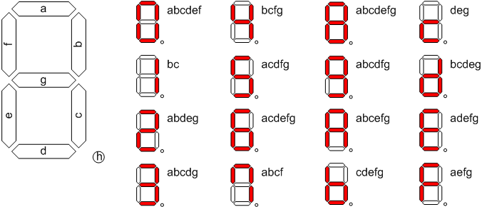
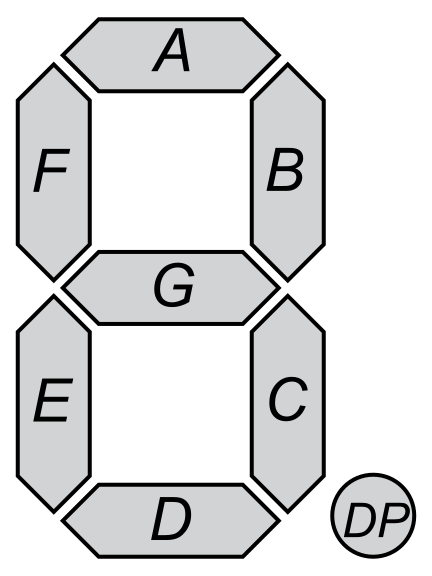
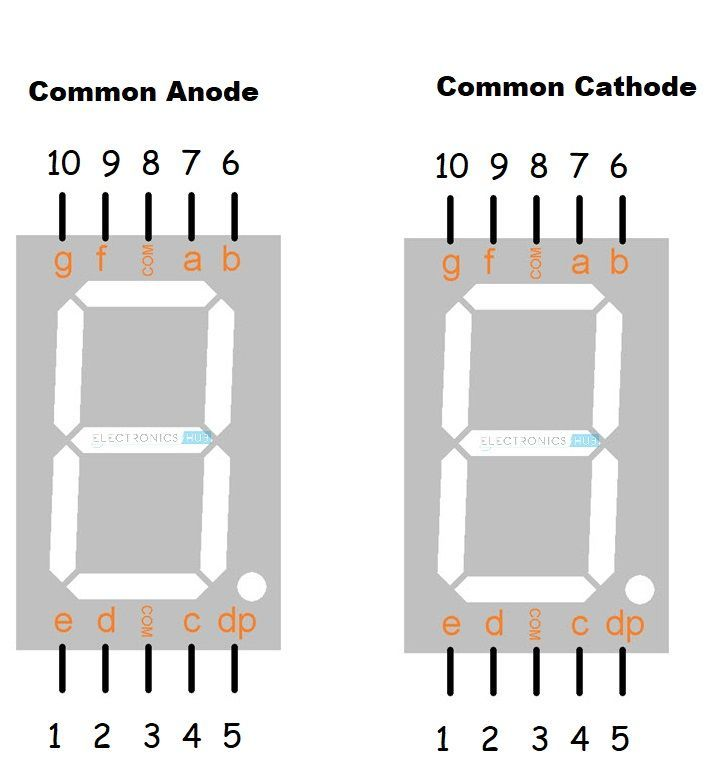

# 7-Segment



**7 Segment Display :** อุปกรณ์แสดงผลตัวเลข และ อักขระพื้นฐาน ทำงานโดยการควบคุมการเปล่งแสงของ **LED 7 ส่วน (a-g)** ที่จัดเรียงในรูปแบบเลข 8 และ อาจมี **จุดทศนิยม (DP)** เพิ่มเติม

**หลักการทำงาน :** เลือกเปิด/ปิด LED แต่ละส่วนด้วยการจ่ายกระแสไฟฟ้า เพื่อสร้างรูปร่างของตัวเลขหรืออักขระที่ต้องการ

**ประเภทการเชื่อมต่อภายใน :**

* **Common Anode (CA) :** ขั้วบวก LED รวม ต่อ VCC; ควบคุมการติดสว่างด้วยการต่อขั้วลบ LED แต่ละส่วนลงกราวด์
* **Common Cathode (CC) :** ขั้วลบ LED รวม ต่อ GND; ควบคุมการติดสว่างด้วยการจ่ายไฟบวกให้ขั้วบวก LED แต่ละส่วน

**ลักษณะทางไฟฟ้า :**

* **แรงดันไฟฟ้าในการขับ (Forward Voltage, Vf) :** โดยทั่วไปประมาณ 1.8 - 3.3 V (ขึ้นอยู่กับสีของ LED)
* **กระแสไฟฟ้าในการขับ (Forward Current, If) :** โดยทั่วไปประมาณ 10 - 20 mA ต่อ Segment
* **การควบคุม :** มักใช้ร่วมกับ IC Driver หรือ Microcontroller เพื่อควบคุมการจ่ายกระแสไฟฟ้าให้แต่ละ Segment



**การประยุกต์ใช้ :** แสดงผลตัวเลขและอักขระในอุปกรณ์อิเล็กทรอนิกส์ เช่น นาฬิกา, เครื่องคิดเลข, มิเตอร์

**ข้อดีเชิงเทคนิค :** ต้นทุนต่ำ, กินพลังงานต่ำ, ควบคุมง่าย

**ข้อจำกัดเชิงเทคนิค :** แสดงผลจำกัดเฉพาะตัวเลขและอักขระพื้นฐาน, ไม่เหมาะกับการแสดงผลกราฟิกซับซ้อน

## ตัวอย่างการใช้งาน

วันนี้เราจะมาเขียนโปรแกรมง่ายๆโดยการสุ่มตัวเลขเพื่อ 0-9 เมื่อมีการกดปุ่ม และ แสดงผลตัวเลขที่ได้จากการสุ่มไปยัง 7 Segment

**การต่อวงจร**

**วงจร (ต่อแบบ Common Cathode) :**



สมมติว่าเราใช้ 7 Segment แบบ **Common Cathode (CC)** นะครับ นี่คือแนวทางการต่อวงจร :

* **ESP8266 Pins :** กำหนดขา Digital ของ ESP8266 สำหรับควบคุมแต่ละ Segment และปุ่มกด (สามารถปรับเปลี่ยนได้ตามต้องการ):
    * D2 (GPIO4) -> Segment A (7)
    * D3 (GPIO0) -> Segment B (6)
    * D4 (GPIO2) -> Segment C (4)
    * D5 (GPIO14) -> Segment D (2)
    * D6 (GPIO12) -> Segment E (1)
    * D7 (GPIO13) -> Segment F (9)
    * D8 (GPIO15) -> Segment G (10)
    * A0 (ADC0) -> ปุ่มกด (ต่อแบบ Pull-up หรือ Pull-down)
* **7 Segment (Common Cathode) :**
    * ขา A, B, C, D, E, F, G ต่อเข้ากับขา Digital ของ ESP8266 ผ่าน **ตัวต้านทานจำกัดกระแส (Current Limiting Resistor)** ค่าประมาณ 220Ω - 330Ω (สำคัญมากเพื่อป้องกัน LED เสียหาย)
    * ขา Common Cathode (COM) ต่อลง **GND** ของ ESP8266
* **ปุ่มกด :**
    * ขาหนึ่งต่อเข้ากับขา A0 ของ ESP8266
    * อีกขาหนึ่งต่อกับ **GND** (สำหรับการต่อแบบ Pull-up ภายใน ESP8266) หรือ **VCC 3.3V** (สำหรับการต่อแบบ Pull-down ภายนอก)
    * **สำคัญ:** หากต่อแบบ Pull-up (ต่อปุ่มกดกับ GND) ให้เปิดใช้งาน Pull-up ภายใน ESP8266 ในโค้ด หากต่อแบบ Pull-down (ต่อปุ่มกดกับ VCC) ให้เพิ่มตัวต้านทาน Pull-down ภายนอกค่าประมาณ 10kΩ ต่อระหว่างขา A0 และ GND

**แผนภาพวงจรอย่างง่าย (Conceptual) :**

```
     ESP8266
     -------
D2 ---|>|--- A (7 Segment) ---/\/\/\--- GND
D3 ---|>|--- B (7 Segment) ---/\/\/\--- GND
D4 ---|>|--- C (7 Segment) ---/\/\/\--- GND
D5 ---|>|--- D (7 Segment) ---/\/\/\--- GND
D6 ---|>|--- E (7 Segment) ---/\/\/\--- GND
D7 ---|>|--- F (7 Segment) ---/\/\/\--- GND
D8 ---|>|--- G (7 Segment) ---/\/\/\--- GND

A0 ---[Button]-- GND  (Pull-up ภายใน)
```

**ตัวอย่าง Code :**

```c++
// กำหนดขาที่เชื่อมต่อกับ 7 Segment
const int segmentA = D2;
const int segmentB = D3;
const int segmentC = D4;
const int segmentD = D5;
const int segmentE = D6;
const int segmentF = D7;
const int segmentG = D8;

// กำหนดขาที่เชื่อมต่อกับปุ่มกด
const int buttonPin = A0;

// รูปแบบตัวเลข 0-9 สำหรับ 7 Segment (Common Cathode)
byte digits[10] = {
    B00111111, // 0
    B00000110, // 1
    B01011011, // 2
    B01001111, // 3
    B01100110, // 4
    B01101101, // 5
    B01111101, // 6
    B00000111, // 7
    B01111111, // 8
    B01101111  // 9
};

// สถานะของปุ่มกดก่อนหน้า (ใช้สำหรับตรวจจับการกด)
int lastButtonState = HIGH;
bool buttonPressed = false;

void setup() {
    Serial.begin(115200);
    Serial.println("ESP8266 7 Segment Random Number");

    // กำหนดให้ขา 7 Segment เป็น OUTPUT
    pinMode(segmentA, OUTPUT);
    pinMode(segmentB, OUTPUT);
    pinMode(segmentC, OUTPUT);
    pinMode(segmentD, OUTPUT);
    pinMode(segmentE, OUTPUT);
    pinMode(segmentF, OUTPUT);
    pinMode(segmentG, OUTPUT);

    // กำหนดให้ขาปุ่มกดเป็น INPUT_PULLUP (เปิดใช้งาน Pull-up ภายใน)
    pinMode(buttonPin, INPUT_PULLUP);

    // ตั้งค่าเริ่มต้นให้ 7 Segment ดับ
    displayDigit(B00000000);
}

void loop() {
    // อ่านสถานะของปุ่มกด (เนื่องจากใช้ Pull-up, LOW เมื่อกด)
    int currentButtonState = digitalRead(buttonPin);

    // ตรวจจับการกดปุ่ม (เปลี่ยนจาก HIGH เป็น LOW)
    if (currentButtonState == LOW && lastButtonState == HIGH) {
        buttonPressed = true;
        delay(50); // Debounce delay
    }

    // เมื่อมีการกดปุ่ม
    if (buttonPressed) {
        // สุ่มตัวเลข 0-9
        int randomNumber = random(0, 10);
        Serial.print("Random Number: ");
        Serial.println(randomNumber);

        // แสดงผลบน 7 Segment
        displayDigit(digits[randomNumber]);

        buttonPressed = false; // รีเซ็ตสถานะปุ่ม
    }

    lastButtonState = currentButtonState; // อัปเดตสถานะปุ่มก่อนหน้า
}

// ฟังก์ชันสำหรับแสดงผลตัวเลขบน 7 Segment (Common Cathode)
void displayDigit(byte digitPattern) {
    digitalWrite(segmentA, bitRead(digitPattern, 0));
    digitalWrite(segmentB, bitRead(digitPattern, 1));
    digitalWrite(segmentC, bitRead(digitPattern, 2));
    digitalWrite(segmentD, bitRead(digitPattern, 3));
    digitalWrite(segmentE, bitRead(digitPattern, 4));
    digitalWrite(segmentF, bitRead(digitPattern, 5));
    digitalWrite(segmentG, bitRead(digitPattern, 6));
}
```

**คำอธิบาย Code :**

1.  **`const int segmentA = D2;` ... `const int segmentG = D8;` :** กำหนดหมายเลขขาของ ESP8266 ที่เชื่อมต่อกับแต่ละ Segment ของ 7 Segment
2.  **`const int buttonPin = A0;` :** กำหนดหมายเลขขาของ ESP8266 ที่เชื่อมต่อกับปุ่มกด
3.  **`byte digits[10] = { ... };` :** Array ที่เก็บรูปแบบบิตสำหรับการแสดงตัวเลข 0-9 บน 7 Segment แบบ Common Cathode แต่ละ `byte` แทนสถานะของ 7 Segment (บิตที่ 0 คือ A, บิตที่ 1 คือ B, ..., บิตที่ 6 คือ G) `1` หมายถึง LED ติด และ `0` หมายถึง LED ดับ
4.  **`int lastButtonState = HIGH;` และ `bool buttonPressed = false;` :** ตัวแปรสำหรับตรวจจับการกดปุ่มเพื่อหลีกเลี่ยงการสุ่มซ้ำเนื่องจากการกดค้าง
5.  **`void setup() { ... }` :**
    * `Serial.begin(115200);` : เริ่มการสื่อสาร Serial ที่ความเร็ว 115200 bps
    * `pinMode(segmentA, OUTPUT);` ... `pinMode(segmentG, OUTPUT);` : กำหนดให้ขาที่เชื่อมต่อกับ 7 Segment เป็นขาออก (OUTPUT)
    * `pinMode(buttonPin, INPUT_PULLUP);` : กำหนดให้ขาที่เชื่อมต่อกับปุ่มกดเป็นขาเข้า (INPUT) และเปิดใช้งานตัวต้านทาน Pull-up ภายใน ESP8266 (ทำให้ขาเป็น HIGH โดย default และ LOW เมื่อกดปุ่ม)
    * `displayDigit(B00000000);` : ตั้งค่าเริ่มต้นให้ 7 Segment ดับ
6.  **`void loop() { ... }` :**
    * `int currentButtonState = digitalRead(buttonPin);` : อ่านสถานะปัจจุบันของปุ่มกด
    * **การตรวจจับการกดปุ่ม :** ตรวจสอบว่ามีการเปลี่ยนสถานะของปุ่มจาก HIGH (ปล่อย) เป็น LOW (กด) เพื่อระบุการกดปุ่มเพียงครั้งเดียว มีการหน่วงเวลา `delay(50)` เพื่อป้องกันการ "Debounce" (การสั่นของหน้าสัมผัสปุ่ม)
    * **เมื่อมีการกดปุ่ม (`if (buttonPressed)`)** :
        * `int randomNumber = random(0, 10);` : สุ่มตัวเลขจำนวนเต็มตั้งแต่ 0 ถึง 9
        * `Serial.print(...)` และ `Serial.println(...)` : แสดงผลตัวเลขที่สุ่มได้ใน Serial Monitor
        * `displayDigit(digits[randomNumber]);` : เรียกฟังก์ชัน `displayDigit()` เพื่อแสดงตัวเลขที่สุ่มได้บน 7 Segment โดยใช้รูปแบบจาก array `digits`
        * `buttonPressed = false;` : รีเซ็ตสถานะ `buttonPressed` เพื่อรอการกดปุ่มครั้งต่อไป
    * `lastButtonState = currentButtonState;` : อัปเดตสถานะปุ่มกดก่อนหน้าสำหรับการตรวจสอบการเปลี่ยนแปลงในรอบถัดไป
7.  **`void displayDigit(byte digitPattern) { ... }` :** ฟังก์ชันที่รับ `byte` ซึ่งเป็นรูปแบบของตัวเลข และทำการเปิด/ปิดขา Digital ของ ESP8266 ที่เชื่อมต่อกับแต่ละ Segment ตามบิตที่อยู่ใน `digitPattern` ฟังก์ชัน `bitRead()` ใช้เพื่ออ่านค่าของแต่ละบิตใน `digitPattern`

**ข้อควรระวัง :**

* **ตัวต้านทานจำกัดกระแส :** อย่าลืมต่อตัวต้านทานอนุกรมกับแต่ละ Segment ของ 7 Segment เพื่อป้องกันไม่ให้ LED เสียหายเนื่องจากกระแสไฟฟ้ามากเกินไป
* **ประเภทของ 7 Segment :** โค้ดนี้เขียนขึ้นสำหรับ 7 Segment แบบ **Common Cathode (CC)** หากคุณใช้แบบ **Common Anode (CA)** คุณจะต้องปรับรูปแบบบิตใน array `digits` ให้ตรงกัน (โดย `0` จะหมายถึงติด และ `1` จะหมายถึงดับ) และอาจต้องปรับลอจิกในการควบคุมขา (เช่น เปลี่ยน `digitalWrite(segmentX, bitRead(...))` เป็น `digitalWrite(segmentX, !bitRead(...))`)
* **ขา ESP8266 :** ตรวจสอบให้แน่ใจว่าคุณใช้ขา ESP8266 ที่ถูกต้องตามที่คุณกำหนดในโค้ดและการต่อวงจร
* **การต่อปุ่มกด :** หากคุณไม่ได้ใช้ `INPUT_PULLUP` และต่อปุ่มกดกับ VCC คุณจะต้องเพิ่มตัวต้านทาน Pull-down ภายนอก

ก่อนอัปโหลดโค้ด อย่าลืมเลือกบอร์ด "ESP8266" และพอร์ต COM ที่ถูกต้องใน Arduino IDE นะครับ! ขอให้สนุกกับการทดลองครับ! 😊