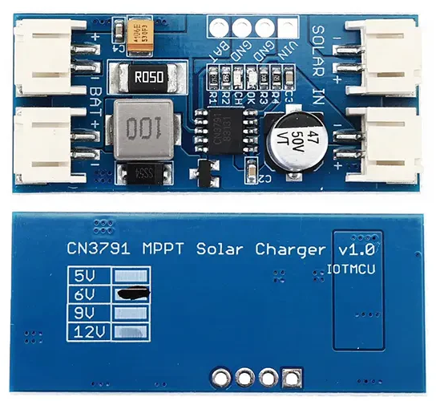
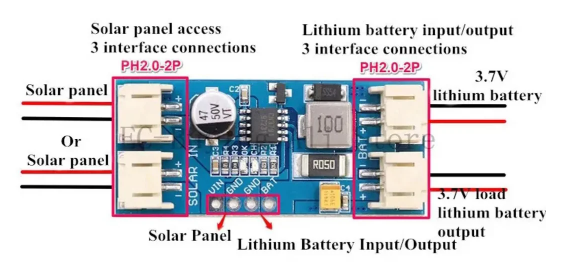

# Solar Charger MPPT (CN3791)



**โมดูล Solar Charger MPPT CN3791 : เพื่อนคู่ใจพลังงานแสงอาทิตย์ของคุณ**

โมดูล CN3791 เป็นวงจรชาร์จแบตเตอรี่ลิเธียมไอออน/โพลิเมอร์จากแผงโซลาร์เซลล์ที่มีประสิทธิภาพสูง ด้วยเทคโนโลยี **Maximum Power Point Tracking (MPPT)** ทำให้มันสามารถดึงพลังงานสูงสุดจากแผงโซลาร์เซลล์ได้ในทุกสภาพแสง

โมดูลนี้ยังเป็นหัวใจสำคัญสำหรับโปรเจกต์พลังงานแสงอาทิตย์ขนาดเล็กอีกด้วย มาดูกันเลยครับว่ามันทำงานอย่างไร และจะนำไปใช้งานกับ ESP8266/32 ได้อย่างไร พร้อมตัวอย่างโค้ดเบื้องต้นครับ

## หลักการทำงานของ MPPT

ลองนึกภาพตามนะครับ แผงโซลาร์เซลล์ไม่ได้จ่ายแรงดันและกระแสไฟคงที่ แต่จะเปลี่ยนแปลงไปตามความเข้มของแสงอาทิตย์และอุณหภูมิ MPPT ทำหน้าที่เหมือน "นักปรับคลื่น" ที่คอยติดตามจุดทำงานที่แผงโซลาร์เซลล์สามารถจ่ายกำลังไฟฟ้าได้สูงสุด ณ ขณะนั้น แล้วปรับแรงดันและกระแสไฟที่ส่งไปยังแบตเตอรี่ให้เหมาะสม ทำให้ชาร์จแบตเตอรี่ได้อย่างมีประสิทธิภาพสูงสุด ไม่ว่าแดดจะแรงจัดหรือมีเมฆมาบดบัง

**เปรียบเทียบง่ายๆ :** เหมือนกับการปั่นจักรยานขึ้นเขา หากคุณใช้เกียร์ที่ไม่เหมาะสม คุณจะปั่นได้ไม่เร็วและเหนื่อยง่าย แต่ถ้าคุณเปลี่ยนเกียร์ให้เหมาะสมกับความชัน คุณจะสามารถขึ้นเขาได้ง่ายและเร็วขึ้น MPPT ก็เหมือนเกียร์ที่คอยปรับให้การชาร์จแบตเตอรี่มีประสิทธิภาพสูงสุดนั่นเอง

## คุณสมบัติเด่นของ CN3791

* **เทคโนโลยี MPPT :** ดึงพลังงานสูงสุดจากแผงโซลาร์เซลล์
* **รองรับแบตเตอรี่ลิเธียมไอออน/โพลิเมอร์ :** เหมาะสำหรับอุปกรณ์พกพาและ IoT
* **แรงดันไฟฟ้าอินพุตสูงสุด :** 28V (ตรวจสอบสเปคของโมดูลที่คุณใช้)
* **กระแสไฟชาร์จสูงสุด :** ปรับได้ผ่านตัวต้านทาน (โดยทั่วไปคือ 2A)
* **มี LED แสดงสถานะ :** บอกสถานะการชาร์จ (สีแดง) และชาร์จเต็ม (สีน้ำเงิน/เขียว)
* **วงจรป้องกัน :** ป้องกันการชาร์จเกิน (Overcharge) และการจ่ายไฟเกิน (Over-discharge) ของแบตเตอรี่ (ขึ้นอยู่กับการเชื่อมต่อภายนอก)
* **ขนาดเล็ก :** ติดตั้งง่ายในโปรเจกต์ขนาดเล็ก

## ขา (Pinout) ของโมดูล CN3791 (โดยทั่วไป)

* **VIN+ :** ขั้วบวกของอินพุตจากแผงโซลาร์เซลล์
* **VIN- :** ขั้วลบของอินพุตจากแผงโซลาร์เซลล์
* **BAT+ :** ขั้วบวกของแบตเตอรี่
* **BAT- :** ขั้วลบของแบตเตอรี่
* **GND :** กราวด์ (Common Ground)
* **ST :** ขาควบคุมการทำงาน (Active Low - ดึงลงกราวด์เพื่อเปิดการชาร์จ)
* **CHG :** ขาแสดงสถานะการชาร์จ (Output Low เมื่อกำลังชาร์จ)
* **FULL :** ขาแสดงสถานะชาร์จเต็ม (Output Low เมื่อชาร์จเต็ม)
* **TERM :** ขาสำหรับปรับกระแสไฟชาร์จ (เชื่อมต่อกับตัวต้านทานลงกราวด์)

**หมายเหตุ:** ตำแหน่งขาอาจแตกต่างกันไปในแต่ละผู้ผลิต โปรดตรวจสอบเอกสาร (Datasheet) ของโมดูลที่คุณใช้งานเสมอ



* **โมดูล :** CN3791 MPPT Solar Charger
* **สัญลักษณ์บนบอร์ด :**
    * `SOLAR IN +` และ `SOLAR IN -` : ขั้วต่อสำหรับแผงโซลาร์เซลล์
    * `BAT +` และ `BAT -` : ขั้วต่อสำหรับแบตเตอรี่
    * `GND` : ขั้วกราวด์
    * `CH` : LED แสดงผล Charge Status (เทียบเท่า CHG)
    * `OK` : LED แสดงผล Charge Complete Status (เทียบเท่า FULL)
    * `ST` : ขา Enable/Disable Charge (Active Low)
* **แรงดัน :** บนบอร์ดมีสัญลักษณ์สำหรับบอกแรงดันแบตเตอรี่ที่ต้องการชาร์จ เช่น 5V, 6V, 9V, 12V (ในตัวอย่างของผมเป็น 6V) **โปรดสังเกตุสัญลักษณ์บอกแรงดันแบตเตอรี่นี้ให้ตรงกับแรงดันของแบตเตอรี่ที่คุณใช้งาน** การตั้งค่าแรงดันไม่ถูกต้องอาจทำให้แบตเตอรี่เสียหายได้
* **ส่วนประกอบอื่นๆ :** คุณจะเห็น IC CN3791, ตัวเก็บประจุ, ตัวต้านทาน และ Inductor ซึ่งเป็นส่วนประกอบสำคัญในการทำงานของวงจร MPPT และการควบคุมการชาร์จ

## การใช้งานร่วมกับ ESP8266/32

การนำโมดูล CN3791 มาใช้งานร่วมกับ ESP8266 หรือ ESP32 จะช่วยให้คุณสามารถสร้างระบบพลังงานแสงอาทิตย์แบบพกพา หรือระบบเซ็นเซอร์ที่ทำงานด้วยพลังงานแสงอาทิตย์ได้อย่างง่ายดาย คุณสามารถใช้ ESP เพื่อตรวจสอบสถานะการชาร์จ แรงดันแบตเตอรี่ หรือควบคุมการทำงานของอุปกรณ์อื่นๆ ที่เชื่อมต่ออยู่

## การเชื่อมต่อทางไฟฟ้า

1.  **แผงโซลาร์เซลล์ :** เชื่อมต่อขั้วบวกและลบของแผงโซลาร์เซลล์เข้ากับขา `VIN+` และ `VIN-` ของโมดูล CN3791 ตามลำดับ ตรวจสอบให้แน่ใจว่าแรงดันสูงสุดของแผงโซลาร์เซลล์ไม่เกินสเปคที่โมดูลรองรับ
2.  **แบตเตอรี่ :** เชื่อมต่อขั้วบวกและลบของแบตเตอรี่ลิเธียมไอออน/โพลิเมอร์เข้ากับขา `BAT+` และ `BAT-` ของโมดูล CN3791 ตามลำดับ
3.  **ESP8266/32 :**
    * เชื่อมต่อขากราวด์ (GND) ของ ESP กับขากราวด์ (GND) ของโมดูล CN3791
    * (ทางเลือก) เชื่อมต่อขา `CHG` ของ CN3791 เข้ากับขา GPIO ดิจิทัลของ ESP เพื่อตรวจสอบสถานะการชาร์จ
    * (ทางเลือก) เชื่อมต่อขา `FULL` ของ CN3791 เข้ากับขา GPIO ดิจิทัลของ ESP เพื่อตรวจสอบสถานะชาร์จเต็ม
    * (ทางเลือก) หากต้องการควบคุมการเปิด/ปิดการชาร์จ สามารถเชื่อมต่อขา `ST` ของ CN3791 เข้ากับขา GPIO ดิจิทัลของ ESP และตั้งค่าให้เป็นเอาต์พุต (Output)

**ข้อควรระวัง :** ตรวจสอบขั้วการเชื่อมต่อให้ถูกต้องเสมอ การเชื่อมต่อผิดขั้วอาจทำให้อุปกรณ์เสียหายได้

## ตัวอย่าง Code การทำงาน (ESP32 - สามารถปรับใช้กับ ESP8266 ได้)

```cpp
// กำหนดขา GPIO ที่เชื่อมต่อกับโมดูล CN3791 (หากมีการเชื่อมต่อ)
const int chargeStatusPin = 2;   // ขา CHG
const int fullStatusPin = 4;     // ขา FULL
const int enableChargePin = 16;  // ขา ST (ถ้าต้องการควบคุม)

void setup() {
    Serial.begin(115200);
    Serial.println("Solar Charger MPPT CN3791 with ESP32");

    // กำหนดโหมดของขา GPIO (ถ้ามีการใช้งาน)
    pinMode(chargeStatusPin, INPUT_PULLUP); // ใช้ PULLUP ภายในเพื่ออ่าน LOW เมื่อชาร์จ
    pinMode(fullStatusPin, INPUT_PULLUP);   // ใช้ PULLUP ภายในเพื่ออ่าน LOW เมื่อเต็ม
    pinMode(enableChargePin, OUTPUT);       // กำหนดเป็นเอาต์พุตสำหรับควบคุมการชาร์จ

    // เปิดการชาร์จเริ่มต้น (Active Low)
    digitalWrite(enableChargePin, LOW);
    Serial.println("Charging enabled.");
}

void loop() {
    // อ่านสถานะการชาร์จ
    bool isCharging = digitalRead(chargeStatusPin) == LOW;
    bool isFull = digitalRead(fullStatusPin) == LOW;

    Serial.print("Charging: ");
    Serial.println(isCharging ? "Yes" : "No");

    Serial.print("Full: ");
    Serial.println(isFull ? "Yes" : "No");

    // ตัวอย่างการควบคุมการชาร์จ (สามารถเพิ่มเงื่อนไขได้ตามต้องการ)
    // เช่น หยุดชาร์จเมื่อแบตเตอรี่เต็ม (โดยปกติ CN3791 จะตัดการชาร์จเองเมื่อเต็ม)
    // หรือเปิด/ปิดการชาร์จตามเวลา หรือเงื่อนไขอื่นๆ

    // หน่วงเวลาเพื่อไม่ให้แสดงผลถี่เกินไป
    delay(1000);
}
```

**คำอธิบาย Code :**

* **กำหนดขา GPIO :** กำหนดหมายเลขขา GPIO ที่เชื่อมต่อกับสัญญาณสถานะของโมดูล CN3791
* **`setup()`:**
    * เริ่มต้น Serial Communication สำหรับการแสดงผล
    * กำหนดโหมดของขา GPIO เป็น `INPUT_PULLUP` สำหรับขา `CHG` และ `FULL` เพื่อให้ง่ายต่อการอ่านสถานะ (ปกติจะปล่อย HIGH และเป็น LOW เมื่อมีการทำงาน)
    * กำหนดโหมดของขา `enableChargePin` เป็น `OUTPUT` หากต้องการควบคุมการเปิด/ปิดการชาร์จ
    * เริ่มต้นการชาร์จโดยการส่งสัญญาณ LOW ไปที่ขา `enableChargePin` (เนื่องจากเป็น Active Low)
* **`loop()`:**
    * อ่านสถานะจากขา `chargeStatusPin` และ `fullStatusPin` หากอ่านค่าได้ `LOW` แสดงว่ากำลังชาร์จหรือชาร์จเต็มแล้ว
    * แสดงสถานะการชาร์จและสถานะชาร์จเต็มผ่าน Serial Monitor
    * (ส่วนที่ Comment ไว้) เป็นตัวอย่างแนวคิดในการควบคุมการชาร์จผ่าน ESP ซึ่งโดยปกติโมดูล CN3791 จะมีวงจรตัดการชาร์จเมื่อแบตเตอรี่เต็มอยู่แล้ว การควบคุมผ่าน ESP อาจมีประโยชน์ในกรณีที่ต้องการจัดการพลังงานที่ซับซ้อนมากขึ้น
    * หน่วงเวลา 1 วินาที ก่อนที่จะอ่านค่าสถานะอีกครั้ง

**การปรับปรุงเพิ่มเติม :**

* **การอ่านแรงดันแบตเตอรี่ :** หากต้องการทราบแรงดันแบตเตอรี่ คุณจะต้องใช้วงจรแบ่งแรงดัน (Voltage Divider) ต่อเข้ากับขา Analog ของ ESP และทำการอ่านค่า Analog จากนั้นแปลงเป็นค่าแรงดันจริง
* **การแสดงผลบนจอ LCD/OLED :** คุณสามารถนำสถานะการชาร์จและแรงดันแบตเตอรี่ไปแสดงผลบนจอ LCD หรือ OLED เพื่อให้ผู้ใช้เห็นสถานะของระบบได้ง่ายขึ้น
* **การส่งข้อมูลไปยัง Cloud :** หากต้องการตรวจสอบสถานะของระบบจากระยะไกล คุณสามารถเชื่อมต่อ ESP เข้ากับเครือข่าย Wi-Fi และส่งข้อมูลไปยัง Cloud Platform ต่างๆ เช่น ThingSpeak, Adafruit IO, หรือ Firebase

## สรุป

โมดูล Solar Charger MPPT CN3791 เป็นเครื่องมือที่มีประสิทธิภาพสำหรับการจัดการพลังงานแสงอาทิตย์ในโปรเจกต์ของคุณ เมื่อนำมาใช้งานร่วมกับ ESP8266/32 คุณจะสามารถสร้างระบบที่ชาญฉลาดและทำงานด้วยพลังงานสะอาดได้อย่างน่าสนใจ อย่าลืมศึกษา Datasheet ของโมดูลที่คุณใช้ และทดลองปรับปรุงโค้ดให้เข้ากับความต้องการของโปรเจกต์ของคุณนะครับ หากมีคำถามเพิ่มเติม ถามมาได้เลยนะครับ ยินดีช่วยเหลือเสมอ!

**คำแนะนำเพิ่มเติมสำหรับการใช้งาน :**

1.  **ตรวจสอบ Datasheet :** แม้ว่าข้อมูลเบื้องต้นจะเหมือนกัน แต่เพื่อความแม่นยำสูงสุด ควรอ้างอิง Datasheet ของโมดูล CN3791 ที่คุณซื้อมา เพื่อดูรายละเอียด Pinout ที่ถูกต้อง, แรงดันและกระแสไฟฟ้าสูงสุดที่รองรับ, และคำแนะนำในการใช้งานอื่นๆ
2.  **การตั้งค่ากระแสชาร์จ :** โดยทั่วไป กระแสชาร์จจะถูกกำหนดโดยตัวต้านทานภายนอก (ขา `TERM` ในคำอธิบายก่อนหน้า) หากคุณต้องการปรับกระแสชาร์จ โปรดศึกษา Datasheet เพื่อคำนวณค่าตัวต้านทานที่เหมาะสมกับความจุของแบตเตอรี่ของคุณ (โดยทั่วไปไม่ควรเกิน 1C ของแบตเตอรี่)
3.  **การป้องกันแบตเตอรี่ :** โมดูล CN3791 มีวงจรป้องกันการชาร์จเกิน (Overcharge) ในตัว แต่อาจไม่มีวงจรป้องกันการจ่ายไฟเกิน (Over-discharge) ในตัว หากโปรเจกต์ของคุณมีการจ่ายไฟออกจากแบตเตอรี่ ควรมีวงจรป้องกันการจ่ายไฟเกินเพิ่มเติม เพื่อป้องกันแบตเตอรี่เสียหาย
4.  **การทดสอบ :** ก่อนใช้งานจริงกับโปรเจกต์ ESP8266/32 ของคุณ ควรทดสอบการทำงานของโมดูล CN3791 กับแผงโซลาร์เซลล์และแบตเตอรี่ก่อน เพื่อให้แน่ใจว่าการชาร์จทำงานได้อย่างถูกต้อง
