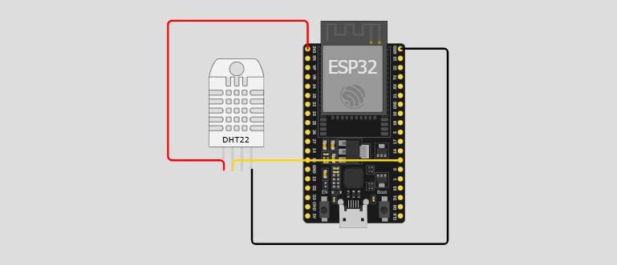

# DHT22

**DHT11, DHT22 Pinout**


**Libraries**

- [Adafruit Unified Sensor library](https://github.com/adafruit/Adafruit_Sensor) version ปัจจุบัน 1.1.15
- [DHT library from Adafruit](https://github.com/adafruit/DHT-sensor-library) version ปัจจุบัน 1.4.6
- หรือ ค้นหา "DHT sensor library by Adafruit" ใน Library Manager

**Circuit**



**Example Code**

```C++
#include "DHT.h"                            // รวมไฟล์เฮดเดอร์ DHT.h ซึ่งมีคำจำกัดความของคลาส และ ฟังก์ชันที่ใช้ในการสื่อสารกับเซ็นเซอร์ DHT

#define DHTPIN 4                            // กำหนดค่าคงที่ (Define) ชื่อ DHTPIN ให้มีค่าเป็น 4 หมายความว่าขา Data ของเซ็นเซอร์ DHT จะเชื่อมต่อกับ Digital Pin 4                                            
                                            // ใน ESP8266 แนะนำให้ใช้ Pin : 3, 4, 5, 12, 13 หรือ 14
                                            // Pin 15 ก็สามารถใช้งานได้ แต่ต้องถอดเซ็นเซอร์ DHT ออกระหว่างการอัปโหลดโปรแกรม

#define DHTTYPE DHT22                       // กำหนดค่าคงที่ชื่อ DHTTYPE ให้มีค่าเป็น DHT22

DHT dht(DHTPIN, DHTTYPE);                   // สร้าง Object ชื่อ dht จากคลาส DHT โดยส่งค่า DHTPIN (คือ 4) และ DHTTYPE (คือ DHT22) เป็นอาร์กิวเมนต์ให้กับ Constructor เพื่อกำหนดขาที่เชื่อมต่อและชนิดของเซ็นเซอร์

void setup() {
    Serial.begin(9600);                     // เริ่มต้นการสื่อสารแบบ Serial Communication ด้วยความเร็ว 9600 บิตต่อวินาที
    Serial.println(F("DHTxx test!"));       // พิมพ์ข้อความ "DHTxx test!" ไปยัง Serial Monitor

    dht.begin();                            // เรียกใช้งานฟังก์ชัน begin() ของ Object dht เพื่อเริ่มต้นการทำงานของเซ็นเซอร์ DHT
}

void loop() {
    // Wait a few seconds between measurements.
    delay(2000);                            // หน่วงเวลา (Delay) การทำงานของโปรแกรมเป็นเวลา 2000 มิลลิวินาที

    // Reading temperature or humidity takes about 250 milliseconds!
    // Sensor readings may also be up to 2 seconds 'old' (its a very slow sensor)
    float h = dht.readHumidity();           // เรียกใช้ฟังก์ชัน readHumidity() ของ dht อ่านค่า และ เก็บค่า ไว้ในตัวแปร h (ทศนิยม)

    // Read temperature as Celsius (the default)
    float t = dht.readTemperature();        // เรียกใช้ฟังก์ชัน readTemperature() ของ dht อ่านค่า และ เก็บค่า ไว้ในตัวแปร t (องศา C)

    // Read temperature as Fahrenheit (isFahrenheit = true)
    float f = dht.readTemperature(true);    // เรียกใช้ฟังก์ชัน readTemperature() โดยส่งค่า true คืออ่านค่าองศา F และ เก็บไว้ในตัวแปร f

    // Check if any reads failed and exit early (to try again).
    // ตรวจสอบว่าการอ่านค่าความชื้น (h), อุณหภูมิเซลเซียส (t), หรืออุณหภูมิฟาเรนไฮต์ (f) ล้มเหลวหรือไม่ 
    // ฟังก์ชัน isnan() จะคืนค่า true หากตัวแปรนั้นไม่ใช่ตัวเลข (Not-a-Number)
    if (isnan(h) || isnan(t) || isnan(f)) {
        // ถ้าการอ่านค่าใดค่าหนึ่งล้มเหลว จะพิมพ์ข้อความ "Failed to read from DHT sensor!" ไปยัง Serial Monitor 
        Serial.println(F("Failed to read from DHT sensor!"));
        // และใช้คำสั่ง return เพื่อออกจากฟังก์ชัน loop() ทำให้โปรแกรมวนกลับไปเริ่มต้น loop() ใหม่
        return;
    }

    // Compute heat index in Fahrenheit (the default)
    // เรียกใช้งานฟังก์ชัน computeHeatIndex() ของ Object dht เพื่อคำนวณค่าดัชนีความร้อน (Heat Index) ในหน่วยฟาเรนไฮต์ 
    // โดยใช้ค่าอุณหภูมิฟาเรนไฮต์ (f) และความชื้น (h) และเก็บผลลัพธ์ไว้ในตัวแปร hif
    float hif = dht.computeHeatIndex(f, h);

    // Compute heat index in Celsius (isFahreheit = false)
    // เรียกใช้งานฟังก์ชัน computeHeatIndex() เพื่อคำนวณค่าดัชนีความร้อนในหน่วยเซลเซียส โดยใช้ค่าอุณหภูมิเซลเซียส (t), ความชื้น (h),
    // และส่งค่า false เพื่อระบุว่าอุณหภูมิที่ใช้มีหน่วยเป็นอเซลเซียส และเก็บผลลัพธ์ไว้ในตัวแปร hic
    float hic = dht.computeHeatIndex(t, h, false);

    Serial.print(F("Humidity: "));          // พิมพ์ข้อความ "Humidity: " ไปยัง Serial Monitor
    Serial.print(h);                        // พิมพ์ค่าความชื้น (h) ไปยัง Serial Monitor
    Serial.print(F("%  Temperature: "));    // พิมพ์ข้อความ "%  Temperature: " ไปยัง Serial Monitor
    Serial.print(t);                        // พิมพ์ค่าอุณหภูมิในหน่วยเซลเซียส (t) ไปยัง Serial Monitor
    Serial.print(F("°C "));                 // พิมพ์ข้อความ "°C " (องศาเซลเซียสและเว้นวรรค) ไปยัง Serial Monitor
    Serial.print(f);                        // พิมพ์ค่าอุณหภูมิในหน่วยฟาเรนไฮต์ (f) ไปยัง Serial Monitor
    Serial.print(F("°F  Heat index: "));    // พิมพ์ข้อความ "°F  Heat index: " (องศาฟาเรนไฮต์และเว้นวรรคสองครั้ง) ไปยัง Serial Monitor
    Serial.print(hic);                      // พิมพ์ค่าดัชนีความร้อนในหน่วยเซลเซียส (hic) ไปยัง Serial Monitor
    Serial.print(F("°C "));                 // พิมพ์ข้อความ "°C " ไปยัง Serial Monitor
    Serial.print(hif);                      // พิมพ์ค่าดัชนีความร้อนในหน่วยฟาเรนไฮต์ (hif) ไปยัง Serial Monitor
    Serial.println(F("°F"));                // พิมพ์ข้อความ "°F" (องศาฟาเรนไฮต์) และขึ้นบรรทัดใหม่ไปยัง Serial Monitor   
}
```
